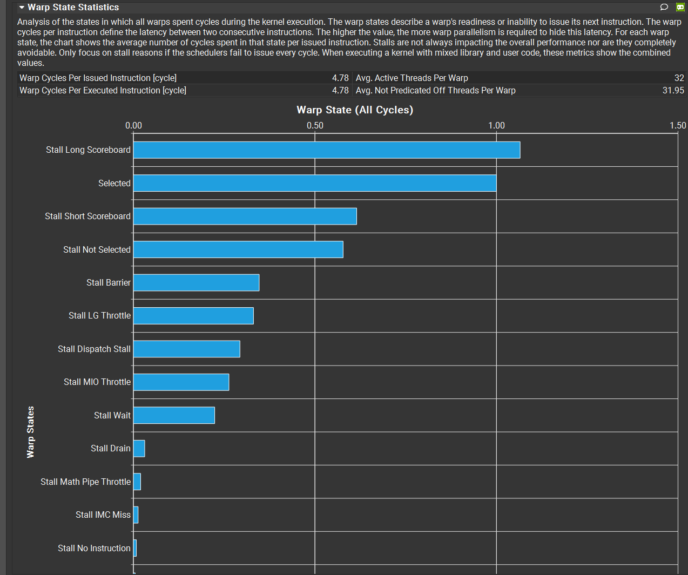

## Environment

| | |
|---|---|
| GPU | RTX 3060 Ti (sm_86, 38 SMs, ~448 GB/s) |
| OS | Windows + WSL2, Ubuntu 22.04.5 |
| Toolkit | CUDA 12.9 (nvcc V12.9.86), driver 615.65.06 |
| Profiler | Nsight Compute 2025.2.1 |

Under WSL, `ncu` fails with `ERR_NVGPUCTRPERM` until GPU performance
counters are opened up in the Windows NVIDIA Control Panel
(Desktop → Enable Developer Settings, then Developer → Manage GPU
Performance Counters → allow all users), followed by `wsl --shutdown`.

Verify the toolchain and profiler counter access:

    $nvcc -arch=sm_86 tools/smoke_test.cu -o build/smoke
    NVIDIA GeForce RTX 3060 Ti  sm_86  38 SMs  448 GB/s

    $ncu --set basic build/smoke
    
    [1433] smoke@127.0.0.1
    k(float *) (1, 1, 1)x(32, 1, 1), Context 1, Stream 7, Device 0, CC 8.6
    Section: GPU Speed Of Light Throughput
    ----------------------- ----------- ------------
    Metric Name             Metric Unit Metric Value
    ----------------------- ----------- ------------
    DRAM Frequency                  Ghz         6.71
    SM Frequency                    Ghz         1.38
    Elapsed Cycles                cycle         2616
    Memory Throughput                 %         1.42
    DRAM Throughput                   %         1.42
    Duration                         us         1.89
    L1/TEX Cache Throughput           %        50.89
    L2 Cache Throughput               %         1.22
    SM Active Cycles              cycle        23.58
    Compute (SM) Throughput           %         0.00
    ----------------------- ----------- ------------

    OPT   This kernel grid is too small to fill the available resources on this device, resulting in only 0.0 full
          waves across all SMs. Look at Launch Statistics for more details.

    Section: Launch Statistics
    -------------------------------- --------------- ---------------
    Metric Name                          Metric Unit    Metric Value
    -------------------------------- --------------- ---------------
    Block Size                                                    32
    Function Cache Configuration                     CachePreferNone
    Grid Size                                                      1
    Registers Per Thread             register/thread              16
    Shared Memory Configuration Size           Kbyte           16.38
    Driver Shared Memory Per Block       Kbyte/block            1.02
    Dynamic Shared Memory Per Block       byte/block               0
    Static Shared Memory Per Block        byte/block               0
    # SMs                                         SM              38
    Stack Size                                                  1024
    Threads                                   thread              32
    # TPCs                                                        19
    Enabled TPC IDs                                              all
    Uses Green Context                                             0
    Waves Per SM                                                0.00
    -------------------------------- --------------- ---------------

    OPT   Est. Speedup: 97.37%
          The grid for this launch is configured to execute only 1 block, which is less than the GPU's 38
          multiprocessors. This can underutilize some multiprocessors. If you do not intend to execute this kernel
          concurrently with other workloads, consider reducing the block size to have at least one block per
          multiprocessor or increase the size of the grid to fully utilize the available hardware resources. See the
          Hardware Model (https://docs.nvidia.com/nsight-compute/ProfilingGuide/index.html#metrics-hw-model)
          description for more details on launch configurations.

    Section: Occupancy
    ------------------------------- ----------- ------------
    Metric Name                     Metric Unit Metric Value
    ------------------------------- ----------- ------------
    Block Limit SM                        block           16
    Block Limit Registers                 block          128
    Block Limit Shared Mem                block           16
    Block Limit Warps                     block           48
    Theoretical Active Warps per SM        warp           16
    Theoretical Occupancy                     %        33.33
    Achieved Occupancy                        %         2.08
    Achieved Active Warps Per SM           warp            1
    ------------------------------- ----------- ------------

    OPT   Est. Local Speedup: 93.75%
          The difference between calculated theoretical (33.3%) and measured achieved occupancy (2.1%) can be the
          result of warp scheduling overheads or workload imbalances during the kernel execution. Load imbalances can
          occur between warps within a block as well as across blocks of the same kernel. See the CUDA Best Practices
          Guide (https://docs.nvidia.com/cuda/cuda-c-best-practices-guide/index.html#occupancy) for more details on
          optimizing occupancy.
    ----- --------------------------------------------------------------------------------------------------------------
    OPT   Est. Local Speedup: 66.67%
          The 4.00 theoretical warps per scheduler this kernel can issue according to its occupancy are below the
          hardware maximum of 12. This kernel's theoretical occupancy (33.3%) is limited by the number of blocks that
          can fit on the SM, and the required amount of shared memory.

    Section: GPU and Memory Workload Distribution
    -------------------------- ----------- ------------
    Metric Name                Metric Unit Metric Value
    -------------------------- ----------- ------------
    Average DRAM Active Cycles       cycle          180
    Total DRAM Elapsed Cycles        cycle       101376
    Average L1 Active Cycles         cycle        23.58
    Total L1 Elapsed Cycles          cycle       100706
    Average L2 Active Cycles         cycle       150.29
    Total L2 Elapsed Cycles          cycle        59424
    Average SM Active Cycles         cycle        23.58
    Total SM Elapsed Cycles          cycle       100706
    Average SMSP Active Cycles       cycle         5.83
    Total SMSP Elapsed Cycles        cycle       402824
    -------------------------- ----------- ------------

## Build and run

    $make                      # builds build/test_gemm
    $make test                 # builds, then runs every registered kernel
    $make test K=naive         # only kernels whose name contains "naive"
    $make test CASE=aligned    # only the aligned shape (exact name); combines with K=
    $./build/test_gemm -n -c aligned registerTV   # time only, skip the CPU reference and check
    
    Other targets:
    $make smoke                # toolchain + profiler check, as above
    $make clean                # objects and build/test_gemm
    $make clean && make        # full rebuild from nothing
    $make ARCH=sm_80           # a different GPU
    $make clean && make OPT="-O2 -Xptxas -v"   # registers/spills per kernel

    Header dependencies are tracked (`-MMD -MP`), so editing `gemm.h` or
    `harness.cuh` rebuilds exactly the objects that included it. `make` reporting
    `Nothing to be done for 'all'` means the binary is genuinely current.

## Current state 
    $ ./build/test_gemm -c aligned
    reference: CPU   tol 1e-04   case "aligned"

    === aligned   M=512 K=1024 N=1024 ===
    [naive]
    worst at (288,0): gpu=0.025224 ref=0.025216
    max rel err: 2.382e-05  [pass]
        1.202 ms     893.17 GFLOP/s    5.51% of peak
    [smem]
    worst at (288,0): gpu=0.025224 ref=0.025216
    max rel err: 2.382e-05  [pass]
        0.977 ms    1099.28 GFLOP/s    6.79% of peak
    [registerT]
    worst at (288,0): gpu=0.025224 ref=0.025216
    max rel err: 2.382e-05  [pass]
        0.240 ms    4468.56 GFLOP/s   27.58% of peak
    [rt]
    worst at (288,0): gpu=0.025224 ref=0.025216
    max rel err: 2.382e-05  [pass]
        0.260 ms    4128.25 GFLOP/s   25.48% of peak
    [rt_V_AsBs]
    worst at (288,0): gpu=0.025224 ref=0.025216
    max rel err: 2.382e-05  [pass]
        0.232 ms    4619.28 GFLOP/s   28.51% of peak

**aligned** has every dim a multiple of 32, so no kernel in the ladder ever
runs a partial tile. It carries the sweep: the GFLOP/s in `docs/PLAN.md` are
this shape, so changing it means restating the baseline.

**ragged** has every dim at 32k+1, leaving exactly one valid row and one valid
column in the final tile -- 31 of every 32 threads there must be masked off. It
is correctness-only and deliberately untimed. This is the case that catches a
bad bounds guard: an off-by-one column test (`col <= N` instead of `col < N`) passes
the aligned shape clean, because the grid covers N=1024 exactly and the extra
column is never generated, and fails ragged at `4.2e+01`.

A and B come from fixed seeds (42 / 1337), and `dC` is zeroed before each
launch, so an element a kernel never writes reads back as 0 and shows up as an
error rather than as leftover state. A kernel is timed only if it passes.
Tolerance is 1e-4 (`tests/test_gemm.cu`): FP32 accumulation over K=1024 lands
near 2e-5 against the CPU reference (also float, different summation order), so the check catches a
broken kernel, not a differently-rounded one. Exit status is 0 when every
kernel that ran passed, 1 otherwise.

## profiling
Profiling one kernel, without the warmup and timing launches getting in the way:

    $ncu --set full -k register_tiling_kernel -c 1 -o registerT \
         ./build/test_gemm -p -c aligned registerT

`-p` is profile mode: each matching kernel is launched once, with no CPU
reference, no check and no timing loop. Without it, ncu still waits for the
CPU reference to finish. `-k` takes the `__global__` function name; the last
argument takes the registry name.

## Adding a kernel

Three edits. No build change -- the Makefile globs `src/kernels/*.cu`.

1. `src/kernels/<name>.cu` -- the `__global__` plus a host launcher matching
   `GemmFn` in `src/gemm.h`. Keep the `<<<>>>` in this file: the driver then
   links against a plain host function and needs no `-rdc=true`. Block shape
   and grid math are the kernel's own business, not the driver's.
2. `src/kernels/kernels.h` -- declare the launcher.
3. `src/registry.cu` -- add `{"<name>", launch_<name>},` to the table.

`make test` then runs the old and new kernels against the same reference in
one invocation, which is the before/after the ladder in `docs/PLAN.md` asks for.

## Layout

    src/gemm.h            GemmFn signature, Kernel struct, registry + gemm_cpu decls
    src/harness.cuh       time_kernel, fill_mat, compare_mat
    src/cuda_check.cuh    CUDA_CHECK, CUDA_CHECK_KERNEL
    src/gemm_cpu.cpp      host reference, plain C++, never sees nvcc
    src/registry.cu       name -> launcher table
    src/kernels/          one .cu per kernel, plus kernels.h declaring the launchers
    tests/test_gemm.cu    the driver above
    tools/smoke_test.cu   toolchain + profiler check

## Kernel notes

### naive

Estimated global memory traffic:

    requests issued:     2 · M·N·K        = 4.3 GB
    after coalescing:    ÷ 32 on A, ÷ 8 on B
    after L1 reuse:      ÷ 32 more on B
    what reaches DRAM:   roughly M·K + N·K · (number of blocks that touch it)

### registerT

Each 256-thread block computes a 128×128 tile of C, and each thread computes an
8×8 piece of it, kept in registers. Aligned shape, `./build/test_gemm -c aligned`:

| kernel | ms | GFLOP/s | % of peak |
|---|---|---|---|
| naive | 1.211 | 886 | 5.47 |
| smem | 0.980 | 1096 | 6.76 |
| registerT | 0.242 | 4443 | 27.43 |

Register use, from `nvcc -O3 -arch=sm_86 -Isrc -Xptxas -v -c src/kernels/register_tiling.cu -o /dev/null`:

    Used 128 registers, used 1 barriers, 8192 bytes smem, 388 bytes cmem[0]
    0 bytes stack frame, 0 bytes spill stores, 0 bytes spill loads

One block needs 128 registers × 256 threads = 32768 of the SM's 65536, so two
blocks fit per SM.

**`__launch_bounds__(256, 3)` made it slower.** Asking for three blocks per SM
caps the kernel at 80 registers, and the 8×8 accumulator no longer fits:

    Used 80 registers, used 1 barriers, 288 bytes cumulative stack size, 8192 bytes smem
    288 bytes stack frame, 764 bytes spill stores, 684 bytes spill loads

The spilled values go to local memory, which is backed by the L1/L2 caches and
DRAM, and that costs far more than the extra block per SM buys:

| | registers | spills | ms | GFLOP/s |
|---|---|---|---|---|
| no launch bounds | 128 | none | 0.242 | 4443 |
| `__launch_bounds__(256, 3)` | 80 | 764 B stores, 684 B loads | 0.942 | 1140 |

### rt_V_Bs and rt_V_BsAs

Both start from `registerT` and change only how the tiles reach shared memory.

- **rt_V_Bs** loads both `As` and `Bs` with one `float4` per thread per tile, and
  holds `As` transposed as `[BK][BM]`. The transposed store is four strided
  scalars, but the compute loop then reads `As[kk][row..row+7]` as two `float4`s,
  and that read happens on every one of the `BK` steps while the store happens
  once. It also carries bounds checks, which `registerT` does not.
- **rt_V_BsAs** keeps `As` in `[BM][BK]` order with scalar loads.

At M=K=N=4096, BK=16, best of three runs:

| kernel | ms | GFLOP/s | % of peak |
|---|---|---|---|
| naive | 140.7 | 977 | 6.0 |
| smem | 111.7 | 1231 | 7.6 |
| registerT | 17.7 | 7748 | 47.8 |
| **rt_V_Bs** | **16.1** | **8559** | **52.8** |
| rt_V_BsAs | 20.6 | 6656 | 41.1 |

`rt_V_Bs` is the fastest so far, and it beats `registerT` while also doing the
bounds checks `registerT` skips.

**Measure more than once.** Run-to-run spread on this machine is around 7%, which
is larger than several of the effects below. A single pair of runs made BK=16
look 10% better than BK=8; three runs each showed that was noise.

#### BK sweep, 4096, best of three

| BK | rt_V_Bs | rt_V_BsAs | smem per block |
|---|---|---|---|
| 8 | 16.02 ms | 23.34 ms | 8 KB |
| 16 | 16.07 ms | 20.67 ms | 16 KB |
| 32 | 16.18 ms | 19.62 ms | 32 KB |

BK does nothing for `rt_V_Bs` and a lot for `rt_V_BsAs`. `rt_V_Bs` already moves
each tile with one `LDG.128` per thread, so there is little per-tile overhead
left to amortize; `rt_V_BsAs` issues many more load instructions per tile, so a
longer K step spreads that cost over more work. `rt_V_Bs` stays register-limited
at 96 registers, 2 blocks per SM, so the extra shared memory is free either way.

#### PAD does not pay here

The transposed store does conflict, and padding removes it completely, but it
costs more than it saves:

| PAD | shared ld conflicts | shared st conflicts | ms |
|---|---|---|---|
| 0 | 268,435,456 | 16,777,216 | 16.3 |
| 4 | 805,306,368 | 0 | 22.9 |

Padding shifts each row of `As` by four floats, which breaks the bank pattern the
`float4` reads depend on. Loads run `BK` times per tile and stores once, so the
loads decide it. `PAD` must stay a multiple of 4 regardless, or `&As[kk][row]`
stops being 16-byte aligned and the `float4` read is invalid.

#### Vectorizing by hand is often a no-op

`ptxas` already merges adjacent scalar shared-memory accesses into `LDS.128`.
Writing the `float4` casts by hand changed neither the SASS nor the bank-conflict
count, which is why the first "vectorized" kernel measured identically to the
scalar one. Check before believing a change did anything:

    $cuobjdump -sass build/src/kernels/register_tiling_vectorized.o | grep -oE "LD[SG](\.[A-Z0-9]+)*" | sort | uniq -c

What the transpose actually changed was *which* addresses the compute loop reads,
not the width of the instruction reading them.

## Profiler
$ncu -k register_tiling_vectorized_kernel -c 1   --metrics l1tex__data_bank_conflicts_pipe_lsu_mem_shared_op_ld.sum,l1tex__t_sectors_pipe_lsu_mem_global_op_ld.sum,smsp__inst_executed.sum   ./build/test_gemm -c aligned registerTV
-------------------------------------------------------- ----------- ------------
    Metric Name                                              Metric Unit Metric Value
    -------------------------------------------------------- ----------- ------------
    l1tex__data_bank_conflicts_pipe_lsu_mem_shared_op_ld.sum                  2097152
    l1tex__t_sectors_pipe_lsu_mem_global_op_ld.sum                sector      1045871
    smsp__inst_executed.sum                                         inst     19876608
    -------------------------------------------------------- ----------- ------------

This showes no gains in bank conflicts when we added vectorization for Bs reads, which means compiler already vectorizes the 
reads and we still are accessing the same locations and didnt resolve any bank confilicts. 
This is also verifyable using:
    $cuobjdump -sass build/src/kernels/register_tiling.o | grep LDS.  
which shows only LDS.128. 

Using:
    $ncu --set full -k register_tiling_vectorized_kernel -c 1   --metrics l1tex__data_bank_conflicts_pipe_lsu_mem_shared_op_ld.sum  -o registerTV  ./build/test_gemm -c aligned registerTV
generates registerTV.ncu-rep which can be looked at in nvidia nsight compute gui. 

The profile shows: 
    - Compute (SM) Throughput [%]	34.39
    - Memory Throughput [%]	43.71
both less than 50% and could be improved. 
The warp state statistics shows:

Long Scoreboard dominates. That's waiting on global memory, not shared. Your bank conflicts show up as Short Scoreboard and MIO Throttle, which together are roughly half the Long Scoreboard bar.

Speed of light section also says "This kernel grid is too small to fill the available resources on this device, resulting in only 0.4 full waves across all SMs." 

## Grid adjustment
use 4096 for M, N, K. This shows the real occupancy because all SMs get blocks to work with

## As transpose and vectorization
transposing As and padding TM to TM+4 was performance-neutral on sm_86 with CUDA 12.9, because ptxas already vectorized the strided reads. The 2-way read conflict it removes is offset by the extra store traffic.
=== aligned   M=4096 K=4096 N=4096 ===
rt_vectorized_Bs_As
-------------------------------------------------------- ----------- ------------
    Metric Name                                              Metric Unit Metric Value
    -------------------------------------------------------- ----------- ------------
    l1tex__data_bank_conflicts_pipe_lsu_mem_shared_op_ld.sum                268435456
    l1tex__t_sectors_pipe_lsu_mem_global_op_ld.sum                sector    128889363
    smsp__inst_executed.sum                                         inst   2535022592
    -------------------------------------------------------- ----------- ------------
=== aligned   M=4096 K=4096 N=4096 ===
rt_vectorized_Bs    
-------------------------------------------------------- ----------- ------------
    Metric Name                                              Metric Unit Metric Value
    -------------------------------------------------------- ----------- ------------
    l1tex__data_bank_conflicts_pipe_lsu_mem_shared_op_ld.sum                268435456
    l1tex__t_sectors_pipe_lsu_mem_global_op_ld.sum                sector    129470272
    smsp__inst_executed.sum                                         inst   2539216896
    -------------------------------------------------------- ----------- ------------
**Update, once the transpose was finished.** The note above was written while
`As` was still indexed in the old order. With the store transposed *and* the
compute-loop read switched to two `float4`s, `rt_V_Bs` went 20.2 ms -> 16.3 ms
at 4096, a 21% gain, and it is now the fastest kernel in the ladder. Padding
on top of that is still a loss; see "PAD does not pay here" above.

## Double buffering

`rt_async` replaces the global -> shared load of B with
`__pipeline_memcpy_async` (SASS `LDGSTS.E.BYPASS.128`, 16 bytes per thread) and
double-buffers `Bs`. The copy for tile `t+1` is issued at the top of iteration
`t`, so it overlaps that tile's A load and compute, and `__pipeline_wait_prior(1)`
retires tile `t`'s batch while `t+1` stays in flight.

Structure that makes the accounting work:

    prologue:  prefetch tile 0 -> Bs[0];  commit
    loop t:    if (t+1 < num_tiles) prefetch tile t+1 -> Bs[(t+1)%2]
               commit                  // ALWAYS, even when skipped on the last tile
               load As for tile t
               wait_prior(1)           // two batches in flight, retires t's
               __syncthreads()
               compute from Bs[t%2]
               __syncthreads()

Three traps, all of which we hit:

- **The commit must be unconditional.** `wait_prior(N)` counts batches, so
  skipping the commit on the last iteration shifts the count and the wait
  retires the wrong batch.
- **`wait_prior` only covers the calling thread's own copies.** The compute reads
  `Bs[kk][col..col+7]`, data copied by several threads. Correctness comes from
  the pair: each thread waits for its own copies, then `__syncthreads()` makes
  everyone else's visible.
- **`prefetch` and the prologue must differ by exactly one tile.** Every bug we
  had was the two drifting apart: fetching tile `t` where the compute also read
  tile `t` (no pipelining at all), or starting the loop at `t = 1` (dropping
  tile 0 from the sum). A shared lambda taking `(tile, buf)` makes the `+1` the
  only difference.

Note that `wait_prior` is not a barrier and `racecheck` does not flag an
under-waiting pipeline -- it tracks shared-memory ordering, not async-copy
completion. A wrong wait count passes every test and fails later.

### Measured effect, 4096, from the .ncu-rep files

    $ncu --set full -k rt_vectorized_AsBs -c 1 -o rt_V   ./build/test_gemm -p -c aligned rt_V_AsBs
    $ncu --set full -k rt_async           -c 1 -o rt_async ./build/test_gemm -p -c aligned rt_async

| | rt_V_AsBs (sync) | rt_async | delta |
|---|---|---|---|
| Duration | 20.19 ms | **18.28 ms** | **-9.5%** |
| Elapsed cycles | 26.86 M | 25.74 M | -4.2% |
| Compute (SM) throughput | 63.68% | 67.39% | +3.7 pts |
| Warp cycles per issued inst | 6.18 | 5.86 | -5.2% |
| Eligible warps per scheduler | 1.69 | 2.00 | +18% |
| No-eligible cycles | 36.14% | 32.48% | -3.7 pts |
| Memory throughput | 80.27% | 82.78% | +2.5 pts |
| Static shared per block | 16.4 KB | 32.8 KB | 2x |
| Registers per thread | 96 | 99 | +3 |
| Achieved occupancy | 32.87% | 32.79% | unchanged |

Both captures come from the same binary minutes apart, with `As` and `Bs` both
double-buffered. Durations here are larger than the harness reports (15.76 and
15.36 ms) because ncu replays each launch and fixes clocks; use the harness for
speed and ncu for the mechanism, and never mix the two in one comparison.

**The win is latency hiding, not occupancy.** Both kernels sit at ~33% achieved
occupancy, both capped at 2 blocks/SM by registers. What changed is that the
warps already resident wait less: eligible warps per scheduler went up 18% and
the scheduler found nothing to issue on 3.4 points fewer cycles.

**The stall profile moved off the math.** In the sync kernel the two hottest
SASS lines are `FFMA` at 11.0% and 10.1% of sampled stalls -- warps queued
behind the FMA pipe while operands trickled in. In the async kernel the top
entry is `LDS.128` at 10.4% and FFMA has dropped to 6.1%. Total sampled stall
cycles fell 981K -> 946K. The bottleneck moved from waiting-to-compute toward
shared-memory access, which is the next thing to attack. (Those two stall
figures are from an earlier capture of the same two kernels; the shape of the
result held up in the newer one.)

**DRAM throughput dropped while the kernel got faster.** Same bytes in less
time at lower peak demand: `LDGSTS` streams global -> shared without the
register round-trip, so the traffic is smoother instead of bursty.

**Shared memory is now the next limiter.** 32.8 KB per block puts
`Block Limit Shared Mem` at 3 while `Block Limit Registers` is 2, so registers
still bind and occupancy is untouched -- but there is no headroom left. Any
further shared growth, or dropping below ~85 registers, and shared memory
becomes the cap.

### As is double-buffered too

`As` gets the same treatment as `Bs`: `prefetch_A(tile+1, (tile+1)%2)` alongside
the B prefetch, with `prefetch_A(0, 0)` in the prologue. It stays synchronous --
ordinary loads plus strided shared stores, because the transposed layout puts a
thread's four values `BM+PAD` apart and `LDGSTS` cannot scatter -- so it
contributes no pipeline batches and the wait count stays `wait_prior(1)`.

Two mistakes worth recording, both of which passed the correctness check:

- **`wait_prior(2)` never waits.** Adding a second prefetch does not add a batch
  when that prefetch is synchronous, so only two are ever outstanding and "at
  most 2" is satisfied on arrival.
- **Prefetching both `tile+1` and `tile`** loads every A tile twice. Harmless
  numerically, since the second write puts the same bytes in the same place, but
  it doubles A's global traffic and leaves nothing to overlap.

With both fixed, A-side traffic matches the synchronous kernel to within 0.5%
(131,019,484 sectors against 130,339,738) -- i.e. each tile is fetched once.

## cuBLAS as the ceiling

`cublas` is registered like any other kernel but is not a rung on the ladder: it
is the reference the others are measured against. `src/kernels/cublas_as_ref.cu`
holds one `cublasSgemm` call, with the handle in a function-local static so it
survives across launches -- `GemmFn` has nowhere to put one -- and built on first
use so the harness's warmup launches absorb the milliseconds it costs.

cuBLAS is column-major and our matrices are row-major, and nothing is transposed
to bridge that. A row-major MxN matrix is bit-identical to a column-major NxM
one, so asking for C^T = B^T * A^T gives row-major C: swap the operands, swap m
and n, pass each matrix's row length as its leading dimension, both ops `_N`.

`CUBLAS_PEDANTIC_MATH` keeps SGEMM in true FP32. Left at the default, cuBLAS may
drop to TF32 on the tensor cores -- faster, but not the arithmetic our kernels do,
so the comparison would be between two different computations. Verified with
`NVIDIA_TF32_OVERRIDE=0`, which changes nothing, confirming FP32 either way.

### 4096, best of three

| kernel | ms | GFLOP/s | % of peak | % of cuBLAS |
|---|---|---|---|---|
| naive | 135.8 | 1012 | 6.3 | 10.8 |
| smem | 107.8 | 1275 | 7.9 | 13.6 |
| registerT | 17.40 | 7900 | 48.8 | 84.5 |
| rt | 20.59 | 6674 | 41.2 | 71.3 |
| rt_V_AsBs | 15.76 | 8723 | 53.8 | 93.2 |
| **rt_async** | **15.36** | **8951** | **55.2** | **95.6** |
| cublas | 14.67 | 9369 | 57.8 | 100 |

`rt_async` reaches 95.6% of cuBLAS, with both tiles double-buffered and each A
tile fetched once.

### The tolerance had to scale with K

cuBLAS "failed" the old fixed `1e-4` at 4096 with `1.874e-04`, and it was right
to. The check is really "agrees with a sequential FP32 sum": our kernels
accumulate in increasing k exactly like `gemm_cpu` and stay at `4.489e-05` even
at K=4096, while cuBLAS splits K and reduces in a tree, which drifts further from
the sequential sum -- and is arguably the more accurate of the two, leaving the
CPU reference as the outlier. The deviation also grows with K: `8.048e-05` at
K=1025, `1.874e-04` at K=4096.

So the tolerance is now `1e-4 * sqrt(K/1024)`, the random-walk growth of
independently rounded partial sums:

| shape | K | tol | our kernels | cuBLAS |
|---|---|---|---|---|
| aligned | 4096 | 2.0e-04 | 4.489e-05 | 1.874e-04 |
| ragged | 1025 | 1.0e-04 | 2.781e-05 | 8.048e-05 |

This costs nothing in detection power. At the ragged shape the tolerance is
essentially unchanged from the old fixed value, and the off-by-one column guard
that shape exists to catch still reports `4.2e+01` -- five orders of magnitude of
margin. Each case prints the tolerance in effect in its header.

Note that `cublas` is currently the only fast kernel that runs the ragged shape:
`rt_V_AsBs` and `rt_async` abort there on `assert(M % 4 == 0)`.
